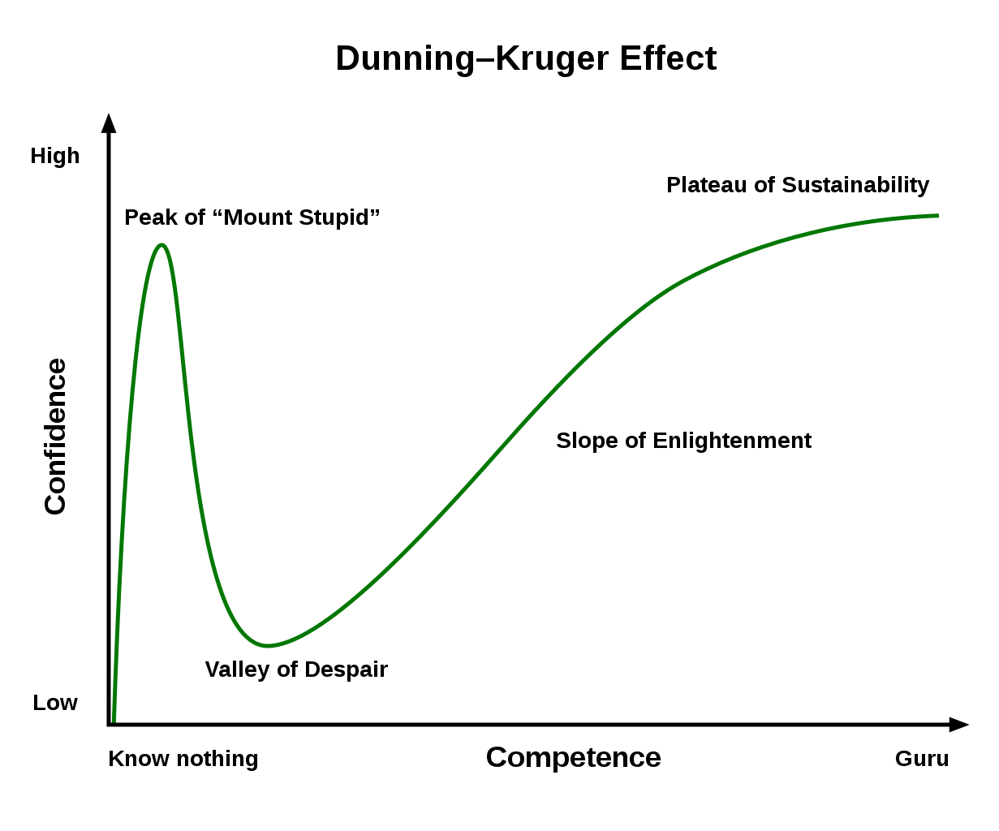

# Introduction

This document is a proof of concept for our master thesis.

The document is separeted into two parts:

1.  The 'full' model where we have a sample of 20 random deliveries on a given date and two terminals.
2.  Modified model where the least important vertice is removed from the 'terminals' set. Measured on between, hence importance of network connectivity. It appears to be the same conclusion when using closeness and eigen vector values.

```{r}
library(igraph)
library(readr)
library(readxl)
library(dplyr)
options(scipen = 999)

#Load the data
data <- read_excel("~/GitHub/Network-Analysis-Speciale/Distance til 3 nodes 20 forsendelser PivotLonger.xlsx")
```

We have abbreviated the two terminals with OD and AR, that is short for Aarhus and Odense.

Notice that we use the `igraph` library.

# The full model

## Arranging data in a dataframe

First we load the data and arrange it in a dataframe that a graph can be build upon.

The weights are found merely by manually looking up the distance from the zip code to the terminals.

```{r}
dat1 <- data[data$Type == 'A',] #Type = A (sender)
dat2 <- data[data$Type == 'M',] #Type = M (receiver)

#Get the vector of pickup --> Terminal and Terminal --> delivery for V1 = OD
v1p <- c(dat1$Afsenderpostnr,rep('OD',20))
v2p <- c(rep('OD',20),dat2$Afsenderpostnr)
distances <- c(dat1$FCODkm,dat2$FCODkm)

#Get the vector of pickup --> Terminal and Terminal --> delivery for V2 = AR
v1p <- c(v1p,dat1$Afsenderpostnr,rep('AR',20))
v2p <- c(v2p,c(rep('AR',20),dat2$Afsenderpostnr))
distances <- c(distances,c(dat1$FCARkm,dat2$FCARkm))

#Combine and add weights
d <- data.frame(V1 = v1p, V2 = v2p, weight = distances)
d
```

## Creating graph from data frame

Now we can create the graph based on the df. We remove all directions, as they are currently of no relevance as goods are always able to flow both directions and we assume that the distance in both directions is equal.

```{r}
#Create the graph data object based on the dataframe
g <- graph_from_data_frame(d, directed = FALSE)
g
```

We have the following abbreviations:

-   U = UNDIRECTED

-   N = name Attribute N

-   W = it's Weighted

-   

    -   = It's not bipartite

*Notice that `igraph` library does not recognize this as a bipartite network before we specify the types, thus do this in the following.*

Now we can set the labels of the vertices and assign a type given their 'role' (sender/delivery vs. terminal)

Notice that we arrange the sets in three rows for easier interpretation, although we only have two sets of vertices.

```{r fig.height=10, fig.width=10,fig.cap="Fat edges = long distances."}
V(g)$label <- V(g)$name # set labels.

# set type - these are merely used for plotting
V(g)$type <- 1 #Start / slut
V(g)[16:17]$type <- 2 #Terminal
#V(g)$type

#Colors for the plot
col <- c("steelblue", "orange")
shape <- c("circle", "square")

#Create vectors to nicely arrange nodes in columns
V(g)$x <- c(rep(1,15),2,2,rep(3,16))
V(g)$y <- c(seq(1,15,1),3,13,seq(1,16,1))

#This is the plot
plot.igraph(x = g, #The graph
            vertex.color = col[V(g)$type], #Define colors type 1 = steelblue etc.
            vertex.shape = shape[V(g)$type],
            edge.width = E(g)$weight / 100 #Divide by 100 to decrease width of the edges
            ,axes = F
            )
```

It is even feasible to plot this according to the lattitude and longitude values. This is just included for the flex.

```{r fig.height=10, fig.width=10}
#Get latitude and longitude for spatial plotting

#Create empty vectors
x <- c()
y <- c()

#Loop over the labels for the vertices
for (i in 1:length(V(g)$label)) {
  #Vertice / node for the current iteration
  node <- V(g)$label[i]
  #Lookup the node in the table to find lat and lon
  x[i] <- as.numeric(data[data$Afsenderpostnr == node,5][1,])
  y[i] <- as.numeric(data[data$Afsenderpostnr == node,4][1,])
}

#Manually insert locations for the terminals
x[16:17] <- c(10.399862,10.059749)
y[16:17] <- c(55.386985,56.160736)

#Insert lat and lon as x and y values
V(g)$x <- x
V(g)$y <- y

plot.igraph(x = g, #The graph
            vertex.color = col[V(g)$type], #Define colors type 1 = steelblue etc.
            vertex.shape = shape[V(g)$type],
            edge.width = E(g)$weight / 100 #Divide by 100 to decrease width of the edges
            ,axes = F
            )
```


## Mean distances and centrality indices

```{r}
############################
###### Mean  Distance ######
############################

dist_matrix = distances(
  g,
  v = V(g),
  to = V(g),
  mode = c("all", "out", "in"),
  weights = NULL,
  algorithm = c("dijkstra")
)

#Mean distance
sum(dist_matrix) / (dim(dist_matrix)[1] * dim(dist_matrix)[2] - length(diag(dist_matrix)))
mean_distance(g) #Mean distance disregarding weights
```

On average the distance of the shipments are 228 kilometers. Notice now we are not including the number of diagonal entries in the division. *Note, the calculation does sum the shortest route between the terminals, although this should probably have been removed, as the network currently only visit one vertice between pickup and delivery.*

The reason we see that the mean distance disregarding edge weights is \< 2 is because includes the distance of 1 from OD to OD and AR to AR. Hence for now a bit misleading.

Now we can calculate some centrality indices. We chose to focus mainly on betweenness as we want to preserve vertices that are important for the connectivity of shortest paths.

Although we do also check closeness and eigen vector centrality to verify the result. We see that OD appears to be the most important vertex for shortest paths, although AR is actually more central in the network, but not for shortest paths.

**Thus we are going to remove AR and see how this affects the network**

```{r}
############################
#### Centrality Indices ####
############################
t(t(sort(betweenness(g),decreasing = T))) %>% head() #Betweenness
t(t(sort(closeness(g),decreasing = T))) %>% head() #Closeness
#plot(sort(closeness(g),decreasing = T)) #Closeness plotte
t(t(sort(eigen_centrality(g)$vector,decreasing = T))) %>% head() #Eigen vector centrality
```

```{r}
rm(list = ls())
```


# The modified model

This is the exact same script just with one vertex in the terminals set.

```{r fig.height=10, fig.width=10}
#Load the data
data <- read_excel("~/GitHub/Network-Analysis-Speciale/Distance til 3 nodes 20 forsendelser PivotLonger.xlsx")
dat1 <- data[data$Type == 'A',] #Type = A (sender)
dat2 <- data[data$Type == 'M',] #Type = M (receiver)
#Get the vector of pickup --> Terminal
v1p <- c(dat1$Afsenderpostnr,rep('OD',20))
v2p <- c(rep('OD',20),dat2$Afsenderpostnr)
distances <- c(dat1$FCODkm,dat2$FCODkm)

  #### REMOVED AR AS THIS IS THE LEAST IMPORTANT VERTICE FOR THE NETWORK ####
# #Get the vector of Terminal --> delivery
# v1p <- c(v1p,dat1$Afsenderpostnr,rep('AR',20))
# v2p <- c(v2p,c(rep('AR',20),dat2$Afsenderpostnr))
# distances <- c(distances,c(dat1$FCARkm,dat2$FCARkm))

#Combine and add weights
d <- data.frame(V1 = v1p, V2 = v2p, weight = distances)
#d

#Create the graph data object based on the dataframe
g <- graph_from_data_frame(d, directed = FALSE)
#g

V(g)$label <- V(g)$name # set labels.

# set type - these are merely used for plotting
V(g)$type <- 1 #Start / slut
V(g)[16]$type <- 2 #Terminal

#Colors for the plot
col <- c("steelblue", "orange")
shape <- c("circle", "square")

#Create vectors to nicely arrange nodes in columns
V(g)$x <- c(rep(1,15),2,rep(3,16))
V(g)$y <- c(seq(1,15,1),7,seq(1,16,1))

#This is the plot
plot.igraph(x = g, #The graph
            vertex.color = col[V(g)$type],
            vertex.shape = shape[V(g)$type],
            edge.width = E(g)$weight / 100
            ,axes = F
)
```


```{r}
############################
###### Mean  Distance ######
############################

dist_matrix = distances(
  g,
  v = V(g),
  to = V(g),
  mode = c("all", "out", "in"),
  weights = NULL,
  algorithm = c("dijkstra")
)
#Mean distance
sum(dist_matrix) / (dim(dist_matrix)[1] * dim(dist_matrix)[2] - length(diag(dist_matrix)))
mean_distance(g) #Mean distance disregarding weights
```

We see that the mean distance for the same network is now increasing, as expected.


```{r}
############################
#### Centrality Indices ####
############################
t(t(sort(betweenness(g),decreasing = T))) %>% head() #Betweenness
t(t(sort(closeness(g),decreasing = T))) %>% head() #Closeness
#plot(sort(closeness(g),decreasing = T)) #Closeness plotte
t(t(sort(eigen_centrality(g)$vector,decreasing = T))) %>% head() #Eigen vector centrality
```


# Comparison

The following is merely a collection of the outputs.

```{r}
# FULL MODEL
#
# Mean distance = 228.6345
#
#      [,1]
# OD    245
# AR    221
# 8660    2
# 2600    0
# 8600    0
# 2630    0
#              [,1]
# AR   0.0002092444
# OD   0.0002066116
# 5260 0.0001984324
# 8660 0.0001950915
# 8240 0.0001933077
# 8700 0.0001864107
#           [,1]
# AR   1.0000000
# 2600 0.8209015
# OD   0.6605834
# 2630 0.5014196
# 2605 0.3342797
# 3700 0.2620759
```


```{r}
# MODFIED MODEL
#
# Mean distance = 293.4062
#
#      [,1]
# OD    465
# 2600    0
# 8600    0
# 2630    0
# 8870    0
# 8700    0
#              [,1]
# OD   0.0002130152
# 5260 0.0002031488
# 5610 0.0001710425
# 5700 0.0001670983
# 5500 0.0001615117
# 4200 0.0001458257
#           [,1]
# OD   1.0000000
# 2600 0.5780535
# 2630 0.3334924
# 8940 0.2593830
# 3700 0.2371501
# 2605 0.2223283
```


# Thougts on the data

As discussed thursday we probably need to delimit the scope of the project.

We roughly hace 1.000 zipcodes in DK where 400 - 500 of these are in Copenhage. We recon that it is possible to generaliza on the zip codes in CPH as these are very dense. To generalize on these dense regions we can either manually select centers or perhaps look into some clustering algorithms. This we have not decided yet.

Ultimately we should get down to 600 zipcodes, hence combinations 360.000 and 359.400 excl. the diagonal. and 179.700 unique combinations, assuming that the distance from A to B = B to A.

It appears that you can get a monthly free credit on the Google API and with 5 google dev accounts, we should be able to get all the distances.

As we would rather delimit the scope on the granularity of the data contra scope the region that we evaluate.

# Conclusion

In light of our discussion Thursday and the POC, we feel confident that this should be feasible. Well knowing that it is likely that we are on the peak of mount stupid.



